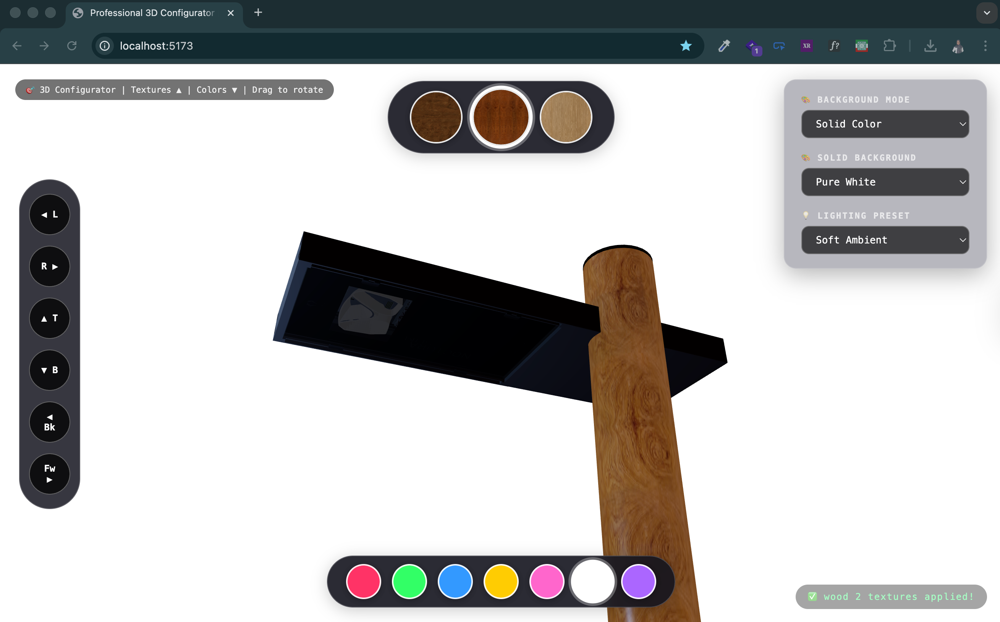

# 🎨 Three.js Material Configurator

> A simple but complete 3D model viewer with real-time PBR material switching, HDRI environments, and lighting controls.



## 🌐 Live Demo

[View Live Demo](https://material-demo.parisashahbazi.com/)


## 📖 About

This is a **learning-focused** Three.js project that demonstrates:

- Loading compressed GLB models (with Draco compression)
- Applying PBR textures to specific material layers
- Switching between HDRI environments in real-time
- Dynamic lighting presets
- Responsive UI that works on desktop and mobile

Perfect for anyone learning Three.js or needing a starting point for 3D product configurators.

## ✨ Features

| Feature | Description |
|---------|-------------|
| 🎨 **PBR Materials** | Switch between Wood, Metal, Carbon, Marble textures with normal/roughness maps |
| 🌍 **HDRI Environments** | Change lighting and reflections with realistic HDRI maps |
| 💡 **Lighting Presets** | Natural, Studio, Dramatic, and Soft lighting options |
| 🎯 **Layer-Specific** | Change materials on specific model layers only |
| 🖱️ **Gizmo Controls** | Quick camera views (Left, Right, Top, Bottom, Front, Back) |
| 📱 **Responsive** | Works perfectly on desktop, tablet, and mobile |
| 🚀 **Performance** | Draco-compressed models for faster loading |

## 🧠 How It Works
┌─────────────────────────────────────────────────────────┐
│ 1. User clicks on a texture circle (e.g., "Wood") │
└─────────────────────────────────────────────────────────┘
↓
┌─────────────────────────────────────────────────────────┐
│ 2. Three.js loads the PBR textures: │
│ - basecolor.jpg (diffuse map) │
│ - normal.jpg (surface detail) │
│ - roughness.jpg (glossiness) │
│ - ao.jpg (ambient occlusion) │
└─────────────────────────────────────────────────────────┘
↓
┌─────────────────────────────────────────────────────────┐
│ 3. Only the target material layer is updated │
│ (keeps original material properties intact) │
└─────────────────────────────────────────────────────────┘
↓
┌─────────────────────────────────────────────────────────┐
│ 4. Scene re-renders with new textures in real-time │
└─────────────────────────────────────────────────────────┘


## 🛠️ Setup & Installation

### Option 1: Local Server (Recommended)

```bash
# Clone or download the project
git clone https://github.com/your-username/your-repo-name.git
cd your-repo-name

# Start a local server (using Python)
python -m http.server 8000

# Or using VS Code Live Server extension
# Right-click index.html → Open with Live Server
Option 2: With Vite (for development)
bash
npm install
npm run dev
Option 3: Just Open (not recommended - CORS issues)
bash
# Double-click index.html (may have texture loading issues)
🎨 Adding Your Own Model
Place your model:

bash
cp /path/to/your/model.glb ./model.glb
Update the path in index.html:

javascript
const MODEL_PATH = './model.glb';
Find target material names (open browser console after loading):

javascript
// This will list all meshes and materials
getMeshNames(currentModel);
getMaterialNames(currentModel);
Update target names:

javascript
const TARGET_MESH_NAME = 'YourMeshName';
const TARGET_MATERIAL_NAME = 'YourMaterialName';
🖼️ Adding Textures
Each material needs this folder structure:

text
textures/
└── your-material-name/
    ├── basecolor.jpg    ← REQUIRED (the actual texture)
    ├── normal.jpg       ← OPTIONAL (bump/detail map)
    ├── roughness.jpg    ← OPTIONAL (shininess map)
    ├── metalness.jpg    ← OPTIONAL (metalness map)
    └── ao.jpg           ← OPTIONAL (ambient occlusion)
Then add to PBR_MATERIALS array:

javascript
{
    id: 'your_material',
    name: 'Display Name',
    previewImage: './textures/your-material-name/basecolor.jpg',
    maps: {
        map: './textures/your-material-name/basecolor.jpg',
        normalMap: './textures/your-material-name/normal.jpg',
        roughnessMap: './textures/your-material-name/roughness.jpg',
        aoMap: './textures/your-material-name/ao.jpg'
    }
}
☀️ Adding HDRI Environments
Download free HDRI files from:

Poly Haven (free, no login)

HDRI Haven

Place in hdri/ folder:

bash
hdri/
├── studio.hdr
├── sunset.hdr
└── forest.hdr
Update paths in code:

javascript
const HDRI_FILES = {
    studio: './hdri/studio.hdr',
    sunset: './hdri/sunset.hdr',
    forest: './hdri/forest.hdr'
};
🎛️ Customization
Change Colors
Edit the color circles in .color-picker div

Add/remove colors from the array

Change Camera Distance
javascript
const distance = maxDim * 1.5;  // Adjust multiplier
Change Lighting
Modify the setLightingPreset() function values:

keyLight.intensity - Main light brightness

fillLight.intensity - Fill light from below

rimLight.intensity - Back rim light

🛠️ Technologies Used
Technology	Purpose
Three.js	3D rendering engine
GLTFLoader	Load GLB/GLTF models
DRACOLoader	Decompress Draco-compressed models
RGBELoader	Load HDR environment maps
OrbitControls	Camera interaction

